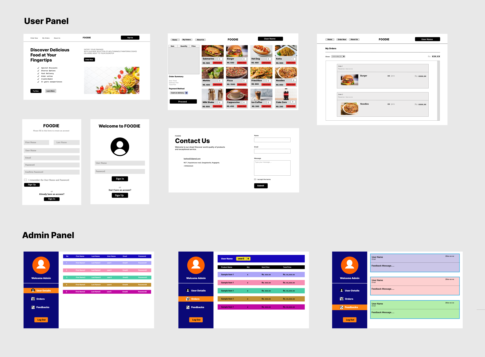

# Foodie Project

The Foodie project is a comprehensive food ordering system developed using Java and SQL, with the NetBeans IDE serving as the primary development platform. Leveraging the Swing package for its graphical user interface, the system is intuitively designed using Java JFrame classes, ensuring seamless navigation and interaction for users.

The project's primary objective is to streamline the process of food ordering, facilitating convenient and efficient transactions for both customers and vendors. In the context of object-oriented programming, Foodie stands as a quintessential example of applying OOP principles to real-world scenarios, emphasizing modularity, encapsulation, and extensibility to enhance code maintainability and scalability. Its importance lies in demonstrating how object-oriented design can be utilized to create robust, user-friendly applications tailored to specific domains like food service.

## Contributors

- **KDHV Senarathna** (https://img.shields.io/github/followers/username?style=social)
- **KGOG Disanayaka** (https://img.shields.io/github/followers/username?style=social)
- **H.N.Methsarani** (https://img.shields.io/github/followers/username?style=social)
- **K.K.S.Priyanath** (https://img.shields.io/github/followers/username?style=social)
- **HMRM Perera** (https://img.shields.io/github/followers/username?style=social)

---

## Project Preview

---

